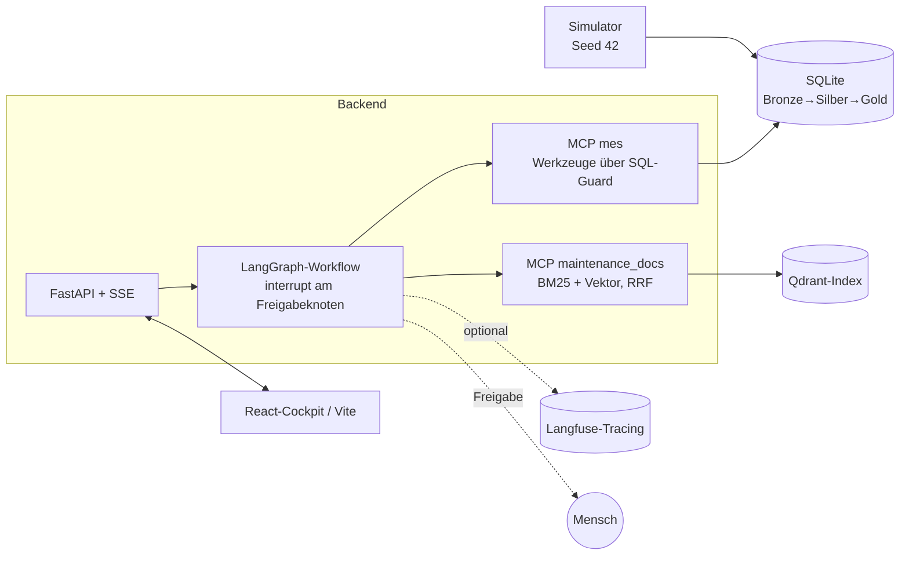

# Production Agent PoC

Untersuchung einer stehenden Produktionslinie: simulierte MES-Daten → Alarmanalyse → historisches Wissen → Wirkungsschätzung → sichere Maßnahmenempfehlung mit menschlicher Freigabe.

Stack: LangGraph · FastMCP (2 Server) · Anthropic Claude · FastAPI/SSE · Vite/React · Langfuse · SQLite (Bronze→Silber→Gold)

Projektstatus (automatisch erzeugt): [docs/status/index.html](docs/status/index.html)

## Schnellstart
```bash
python -m venv .venv && source .venv/bin/activate
make install                            # deps + pre-commit
cp .env.example .env                    # API-Key eintragen
python -m production_agent.data.simulator   # 348 Störungsereignisse (Gold; Kurzstillstände <5min zählen nicht, ADR-0001) → data/gold/mes.sqlite
make test                               # Testsuite (<!-- auto:tests -->411<!-- /auto:tests --> Tests), läuft ohne API-Key
python autopilot/run.py --dry-run       # Prompts der Arbeitspakete ansehen, dann ohne --dry-run laufen lassen
```

Konfiguration steht in `settings.env` (committet), Geheimnisse in `.env` (gitignored). `.env` enthält nur Schlüssel, die auf KEY/SECRET/TOKEN/PASSWORD enden.

## Demo-App starten (5 Befehle)
```bash
make install                                       # 1. Abhängigkeiten + pre-commit
python -m production_agent.data.simulator          # 2. Störungshistorie simulieren → Gold-SQLite
python -m production_agent.mcp.rag_server --ingest # 3. Wartungsdokumente in den RAG-Index laden
make run-api                                        # 4. FastAPI + SSE (uvicorn, Port 8000)
make ui                                             # 5. React-Cockpit (Vite, Port 5173)
```
Der Modus (mock/live) kommt aus `LLM_MODE`/`.env` und wird im Cockpit nur angezeigt. Ohne API-Key läuft der Mock-Pfad; der kostenpflichtige Live-Lauf ist manuell.

## Architektur

Der Agent empfiehlt, er führt nicht aus: jede Maßnahme läuft durch die Action-Policy, der Freigabeknoten ist immer ein `interrupt()`. Details in [docs/adr/](docs/adr/).

## Ops-Cockpit

```bash
make ops   # startet http://localhost:8010
```

Lokale Steuerungsoberfläche für Stefan (unabhängig vom Produktionsleiter-Frontend).
Vier Tabs: **Ablauf** (WP-Kacheln in Zustandsfarbe, Live-Log, Journal), **Stand** (Kennzahlen, Aktionen),
**Konfiguration** (decisions.yaml read-only, editierbare Felder schreiben `config/runtime.yaml` + Audit),
**Präsentation** (bettet `docs/presentation/index.html` ein).
Nur 127.0.0.1; keine Shell-Freitexteingaben; jede Aktion in `config/ops_audit.jsonl` protokolliert.
Dokumentation: [docs/ops.md](docs/ops.md).

## Die Entscheidungsbasis (ADR-0002)
Ein Simulator erzeugt 90 Tage Historie inklusive Auflösung und schreibt sie durch Bronze → Silber → Gold. „Jetzt" ist eine Replay-Uhr
5 Minuten nach Beginn eines Gold-Ereignisses: alles davor ist Historie mit bekannter Lösung, das Ereignis selbst ist offen, seine
Gold-Zeile die verborgene Wahrheit. Historie und aktueller Fall stammen aus derselben Verteilung – und die Eval (Vorhersage ↔ Gold)
fällt gratis ab. Alle Stellschrauben stehen in `decisions.yaml`.

## Was hier schon fertig ist (Sicherheitsfundament)
| Modul | Zweck |
|---|---|
| `config.py` | Settings aus settings.env + .env (SecretStr), Replay-Uhr `SIM_NOW`, Schwellen |
| `graph/state.py` | AgentState – der Zustand einer Untersuchung |
| `api/server.py` | FastAPI: Untersuchung starten, Freigabe (409 ohne wartenden Knoten) |
| `security/sql_guard.py` | SELECT-only, Tabellen-Allowlist, Row-Limit, SQLite `mode=ro` |
| `security/injection_guard.py` | Werkzeugergebnisse als untrusted Daten kapseln, Injection-Muster markieren, kürzen |
| `security/action_policy.py` | Maßnahmen klassifizieren (inform / approval_required / forbidden), Konfidenzschwelle |
| `security/audit.py` | JSONL-Audit jedes Tool-Aufrufs und jeder Freigabe |
| `graph/workflow.py` | 7 Knoten, Verzweigung bei Alarmflut, `interrupt()` am Freigabeknoten, Checkpointer |
| `mcp/mes_server.py` | fachliche Werkzeuge (Anzahl <!-- auto:tools_mes -->3<!-- /auto:tools_mes -->), alle über den Guard |
| `mcp/rag_server.py` | BM25-Suche + RRF-Fusion (Vektorseite folgt in WP2) |
| `data/simulator.py`, `data/replay.py` | deterministischer MES-Simulator (Seed 42), Replay-Uhr, Replay-Fälle, Scoring |
| `autopilot/status.py` | erzeugt docs/status/ und füllt die auto-Marker in der Doku (Fakten statt Handarbeit) |
| `autopilot/guardian.py` | pre-commit: Sicherheit, Konsistenz, Doku-Aktualität – blockiert den Commit (Regeln siehe docs/guardian.md) |
| `autopilot/` | tasks.yaml + run.py: WPs unbeaufsichtigt mit `claude -p`, Gate + Review-Gate je WP, journal.md/json + Commit je WP, status.json fürs Cockpit |
| `docs/test_strategy.md`, `docs/references.md` | Verifikation/Falsifikation je Ebene; Regeln für externe Quellen (Abhängigkeit / Muster / nie) |
| `.claude/agents/`, `.claude/settings.json` | fünf Subagents mit Verzeichnisgrenzen, Rechte-Allowlist |
| CI / pre-commit | ruff, bandit, gitleaks, detect-private-key |

Die Arbeitspakete WP0–WP7 stehen in `autopilot/tasks.yaml`; die Entscheidungsgrundlage in `docs/stack.md` und `docs/adr/`.

## Stand
<!-- auto:stand -->
- fertig: 13 von 16 Paketen
- offen: WP4, WP6, WP7
- Fortschritt: 85 % — siehe [Statusseite](docs/status/index.html)
<!-- /auto:stand -->

Guardian-Regeln (automatisch aus dem Guardian-Docstring):
<!-- auto:guardian_rules -->
Regeln: S1–S9, K1–K10, D1–D9.

- **S1**: keine Secrets, keine .env committet
- **S2**: keine verbotene Bibliothek der Ausschlussliste (CLAUDE.md)
- **S3**: drei MCP-Server (mes=3 Live, knowledge=3 Suche/Verlauf, business_rules=1 Regel), kein *sql/query/write/exec*
- **S4**: schema.sql und ALLOWED_TABLES identisch
- **S5**: decisions.yaml eingefroren (Hash; Aenderung nur mit GUARDIAN_ALLOW_DECISIONS=1)
- **S6**: Sicherheitsmodul geaendert -> Sicherheits-, Protokoll- und Trajektorientests gruen
- **S7**: kein .env-Wert (len>=8) in anderer getrackter/gestagter Datei; S7b .env nur KEY|SECRET|TOKEN|PASSWORD-Schluessel; S7c .env.example-Werte enden auf -EXAMPLE
- **S8**: keine Begriffe der Oeffentlichkeits-Blocklist (.guardian_public/blocklist.sha256)
- **S9**: gestagte Binaerdateien nur unter docs/status/ oder docs/images/ und < 500 KB
- **K1**: jedes src-Modul hat eine Testdatei mit Verifikations- und Falsifikationstest
- **K2**: ruff und bandit sauber
- **K3**: Commit-Message folgt der Konvention (commit-msg-Hook)
- **K4**: Coverage: gesamt >=80, security >=95, mes_server/workflow >=85
- **K5**: jede entry-Zeile in .pre-commit-config.yaml beginnt mit .venv/bin/python
- **K6**: tasks.yaml-WPs stehen in plan.yaml, Abhaengigkeiten sind aufloesbar und azyklisch
- **K7**: tests/acceptance/ nur mit GUARDIAN_ALLOW_ACCEPTANCE=1 aenderbar (Abnahmetests = Spezifikation)
- **K8**: autopilot/ geaendert -> autopilot/selfcheck.py grün (GUARDIAN_SKIP_K8=1 unterdrueckt)
- **K9**: gelernte Rechte (state/denied.json) noch nicht erlaubt -> WARNUNG mit Allow-Vorschlag (blockiert nie)
- **K10**: jeder {{a.b}}-Platzhalter in tasks.yaml existiert in decisions.yaml (Renderfehler = Nachtlauf tot)
- **D1**: jedes src-Modul ist in README oder docs/ namentlich erwaehnt
- **D2**: jede ADR hat Kontext / Optionen / Entscheidung / Konsequenzen
- **D3**: src geaendert -> auch docs/, README oder tests/ geaendert
- **D4**: Aenderungen in src/autopilot/adr/contracts/decisions: AENDERUNGEN.md gestaged, Datum heute, alle fuenf Felder, kein Platzhalter
- **D5**: Titel oberster AENDERUNGEN.md-Eintrag gleich erster Commit-Zeile (Pruefung commit_check.py)
- **D6**: docs/status/status.json gestaged, frisch (<10 min), commit leer oder == HEAD
- **D7**: jeder auto-Marker in getrackten *.md hat den von status.py berechneten Wert
- **D8**: ausserhalb Markern keine getippten Zahlen/Regelbereiche/Coverage in README.md und docs/*.md
- **D9**: README.md hat Abschnitt "## Stand" mit nicht-leerem auto:stand-Marker
<!-- /auto:guardian_rules -->

## Lizenz
MIT, © 2026 Stefan Hüllinghorst – siehe LICENSE.
