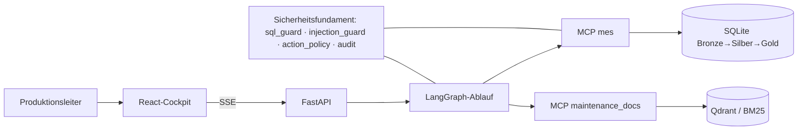

# Architektur – Zielbild und Verträge

## Zielbild

Der Agent liegt außerhalb der Steuerungszone und liest nur (IEC 62443). Der Nachrichtenfluss folgt ADR-0010
(OPC-UA-Alarmevent als JSON, ISA-95-Begriffe): AlarmEvent/StateChange/OrderProgress → Bronze → Silber (Regeln:
Bereinigung, Priorität, Alarmflut-Fenster, Zusammenfassungslücke) → Gold (eine Zeile je Störungsereignis).

## Verträge
| Vertrag | Eigentümer-Lane | Konsumenten | Datei | Änderungsregel |
|---|---|---|---|---|
| MES-Schema | data | mcp, graph | `src/production_agent/data/schema.sql` | additiv; sql_guard-Allowlist mitziehen (S4) |
| MES-Werkzeuge | mcp | graph, ui | `docs/contracts/mes_tools.json` | Signaturen stabil; neue nur mit Anweisung (S3) |
| Nachrichtenformat | data | ui, mcp | `src/production_agent/data/messages.py` | Pydantic, ADR-0010 |
| API-Ereignisse | graph | ui | `docs/contracts/api.md` | SSE-Events additiv |
| Agent-Zustand | graph | api, ui | `src/production_agent/graph/state.py` | additiv |

## Sicherheit quer
Empfehlen ≠ Ausführen: jede Maßnahme durch `action_policy`, Schritt 7 ist `interrupt()`. Werkzeugergebnisse sind Daten
(`sanitize_tool_result`). Alle DB-Zugriffe read-only über `sql_guard`. Jeder Tool-Aufruf und jede Freigabe im Audit.
