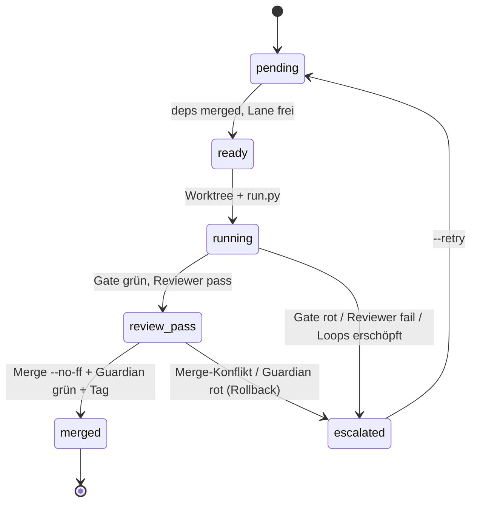

# Orchestrator – Lane-Scheduler mit dauerhaftem Zustand

`autopilot/orchestrate.py` baut alle Pakete aus `autopilot/plan.yaml` spezifikationsbasiert, parallel je Lane,
bis zum Ende. Fertig bleibt fertig (`merged` wird nie wieder angefasst); ein eskalierter Strang blockiert nur
seine Abhängigen, die übrigen Lanes laufen weiter. Der Zustand in `autopilot/state/orchestrator.json` überlebt
den Neustart – Start ist immer Fortsetzung.

## Lanes und Abhängigkeiten
Lanes: `steef` (P/A/WP0, von Hand), `data`, `mcp`, `graph`, `ui`, `qa`, `infra`. Je Lane läuft höchstens ein Paket
gleichzeitig. Die Reihenfolge ergibt sich aus den Abhängigkeiten in `plan.yaml` (Guardian K6 hält Plan und
`tasks.yaml` konsistent und die Abhängigkeiten azyklisch).

## Zustandsmodell

## Stopp- und Fortsetzungsregeln
- `merged` wird nie erneut gebaut oder gemergt.
- `running` nach Abbruch: Worktree prüfen (Journal vorhanden → als `review_pass` behandeln, sonst entfernen → `pending`).
- `escalated`/`exhausted` bleiben stehen bis `--retry <WP>` oder bis sich der Hash von `tasks.yaml`/`decisions.yaml` ändert.
- `blocked` wird frei, sobald die auslösende Abhängigkeit `merged` ist.
- Budget (`--budget-total-usd`, Standard 40): keine neuen Starts über der Grenze, laufende dürfen enden.

## Merge
`git merge --no-ff` mit konventioneller Nachricht, danach Guardian auf `main`. Bei rotem Guardian oder Konflikt:
`git reset --hard ORIG_HEAD` bzw. `git merge --abort`, Paket → `escalated`, Eintrag in `ESCALATION.md`. Nach
erfolgreichem Merge: Tag `wp/<id>`, Worktree entfernen; mit `--push` folgen `git push --tags` und `git push`.

## Was manuell bleibt
P/A/WP0 (Entscheidungsbasis), jede Eskalation (Sync-Paket lesen, entscheiden, `--retry`), der finale Blick vor dem Push.
Aufruf: `python autopilot/orchestrate.py --dry-run` zeigt Lanes und startbereite Pakete; `--push` baut und veröffentlicht.
